# Git and Github Assignment_1
## Task 1 : Demonstrate minimum 15 basic Git command with explanation and screenshot.

### Git Commands : 
1. > git config user.name 

This command is used to view the user name of the person who will be doing the commits.

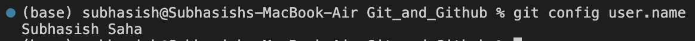

2. > git config user.email

This command is used to view the user email of the person who will be doing the commits.

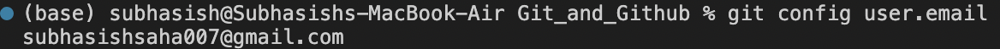

3. > git clone [repo url]

This command is used to obtain a repository from an existing URL.

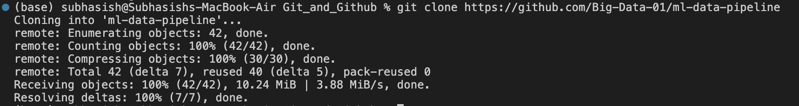

4. > git init [repo name]

This command is used to start a new repository.

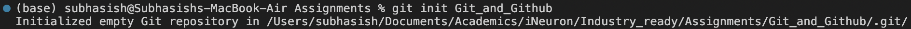

5. > git add [file name]

This command adds one or more or all files to the staging area.

6. > git status 

This command lists all the files that have to be committed.

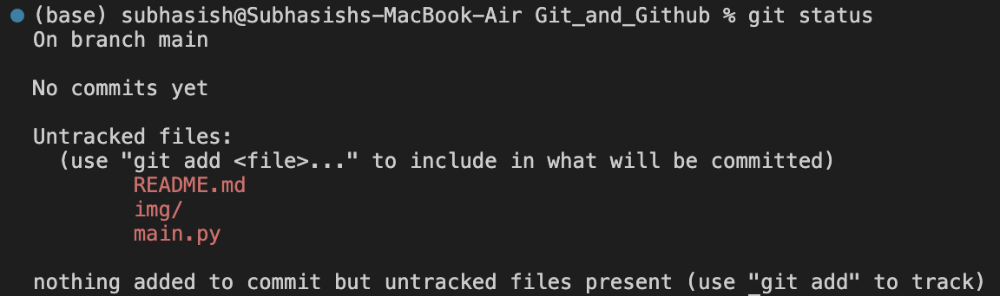

7. > git commit -m "message"

This command records or snapshots the file permanently in the version history.

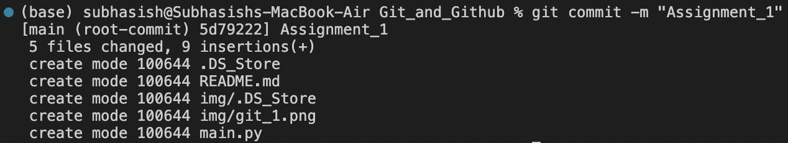

8. > git log

This command is used to list the version history for the current branch.

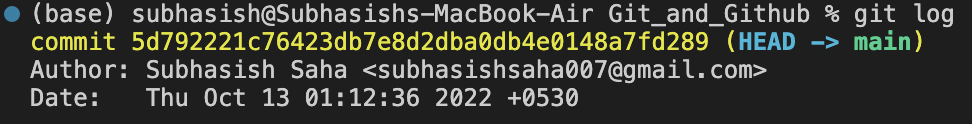

9. > git branch

This command lists all the local branches in the current repository.

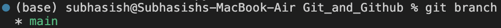

10. > git branch [new branch name]

This command creates a new branch.

11. > git checkout [branch_name]

This command is used to switch from one branch to another.

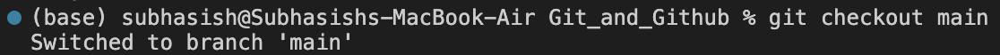

12. > git switch [branch_name] 

This command is also used to switch from one branch to another.

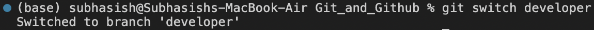

13. > git branch -M [new branch name]

This command is used to rename the current branch.

14. > git remote add origin [repo url]

This command is used to connect your local repository to the remote server.

15. > git push origin main

This command sends the committed changes of master branch to your remote repository.

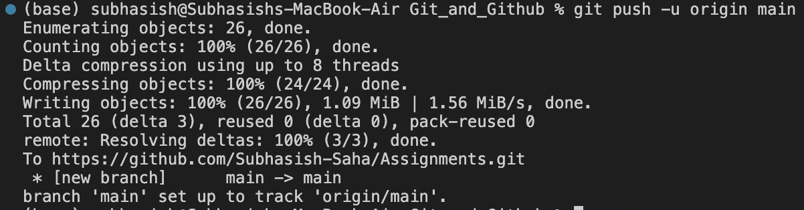

